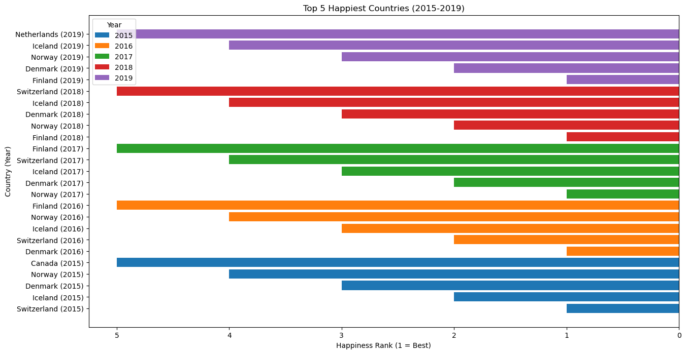
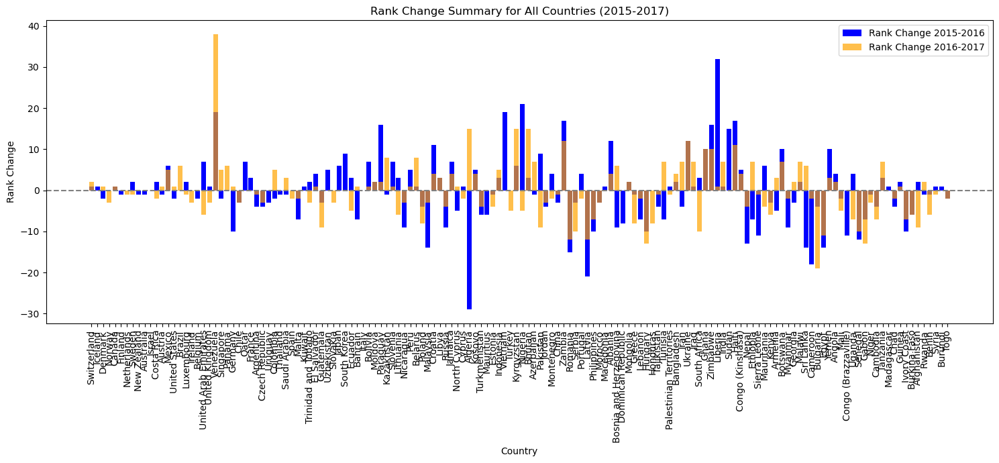
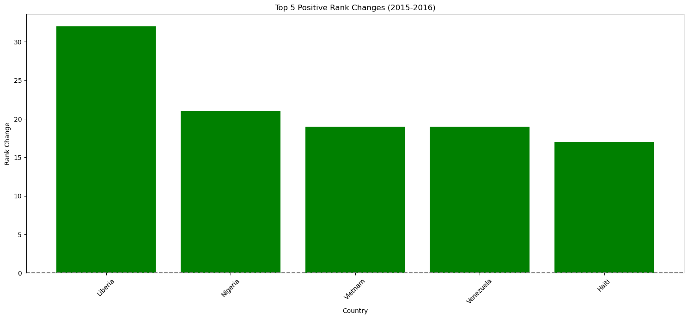
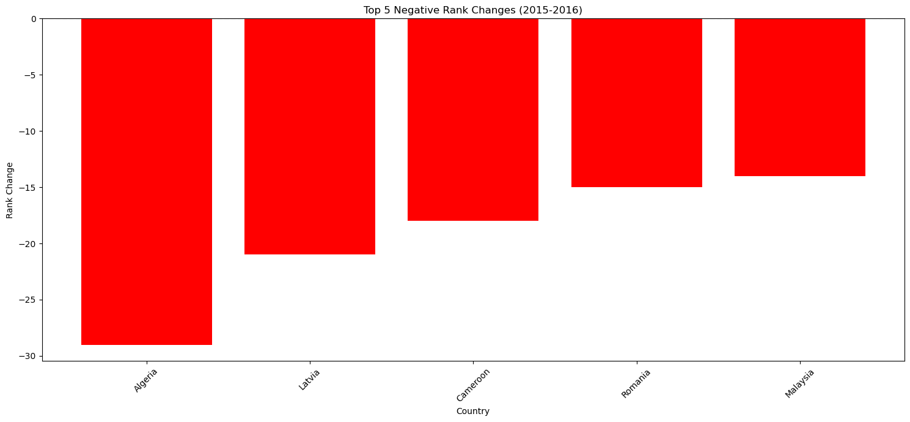
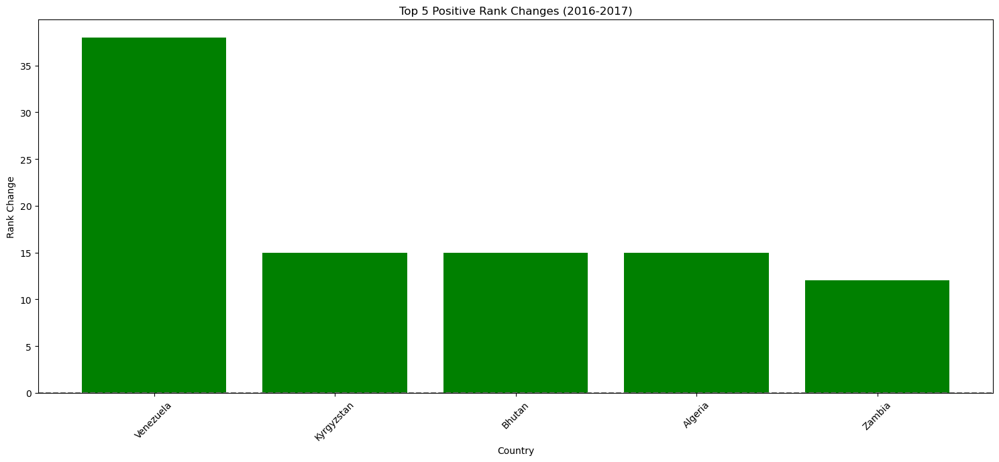
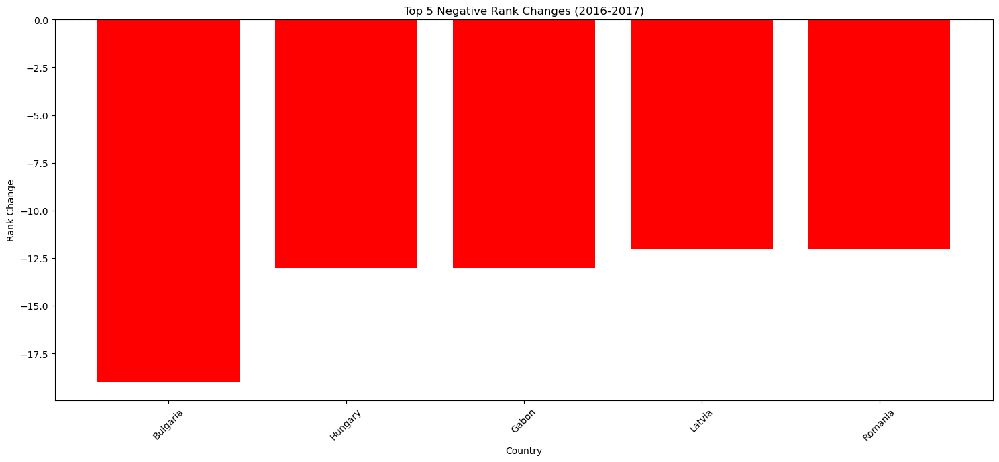
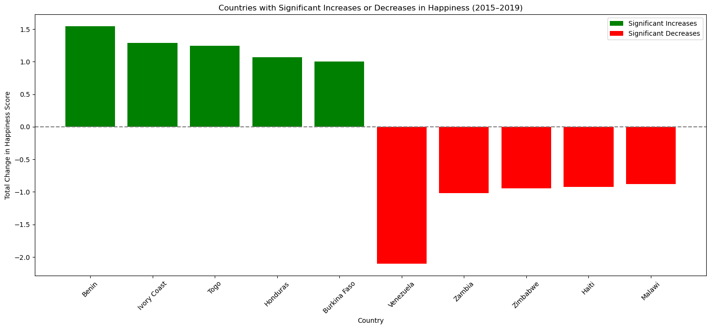
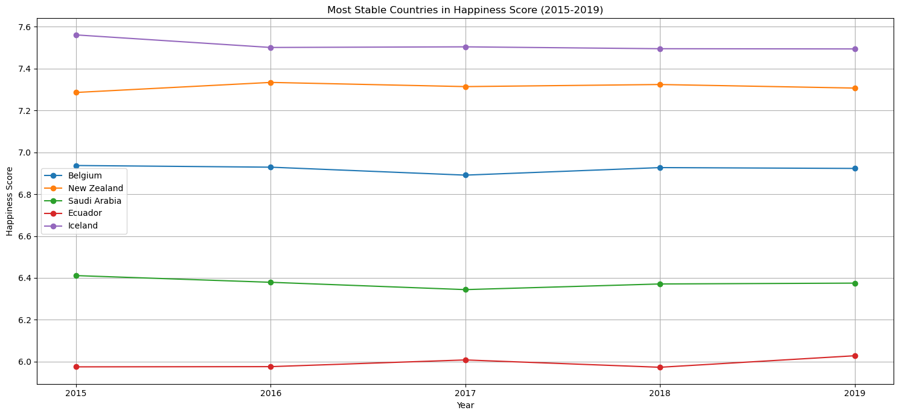

# Happiness Analysis Project

## Overview
This project involves Exploratory Data Analysis (EDA) of the "World Happiness Report" datasets spanning from 2015 to 2019. The datasets quantify various aspects influencing the happiness score of different countries globally.

## Project Objective
The primary goal of this project is to explore, analyze, and identify patterns, anomalies, and insights from happiness data, enhancing data quality, reliability, and accuracy for meaningful interpretations.

## Data Issues and Solutions
During analysis, several issues were identified:

### 1. Missing Columns
Not all yearly datasets had uniform column structures, leading to inconsistent analysis. For example, some datasets lacked columns such as "Trust" or "Generosity."

**Solution:**
- Identified and explicitly addressed these inconsistencies by aligning columns across datasets.
- Missing columns were either imputed using averages or rational assumptions based on other years' data.

### 2. Missing Calculations of "Happy Score"
The "Happiness Score" wasn't directly consistent across datasets due to varying calculation methods or missing data points.

**Solution:**
- Created a Python function (`calculate_happy_score`) that reliably calculates the happiness score using standardized methods based on available features, ensuring consistency across years.

## Exploratory Data Analysis (EDA)
EDA included:
- Initial profiling of data to understand its structure.
- Identifying and visualizing outliers and anomalies through Z-scores and box plots.
- Utilizing correlation heatmaps to detect relationships between variables affecting happiness.
- Interactive visualization with tools like `dtale` for dynamic exploration.

### Visualizations Included:
- Distribution of Happiness Scores

### Top 5 Happiest Countries (2015-2019):

The visualization clearly demonstrates that Nordic and Western European countries like Finland, Denmark, Norway, Iceland, and Switzerland consistently rank the highest in overall happiness.

### Country Rank Changes (2015-2017):
The following visualizations depict rank changes in happiness scores:

#### Rank Change Summary for All Countries (2015-2017)

#### Top 5 Positive Rank Changes (2015-2016)

#### Top 5 Negative Rank Changes (2015-2016)

#### Top 5 Positive Rank Changes (2016-2017)

#### Top 5 Negative Rank Changes (2016-2017)

These visualizations clearly illustrate how country rankings changed significantly between consecutive years.

### Countries with Significant Happiness Changes (2015-2019):

This visualization identifies countries that experienced notable increases or decreases in happiness scores from 2015 to 2019, highlighting significant shifts in overall national well-being.

## Which countries had the most stable happiness scores between 2015 and 2019?
To identify countries with stable happiness scores, standard deviation analysis and variability indices were calculated for each country's happiness scores over the 2015-2019 period. Countries exhibiting minimal fluctuations included:
- Switzerland
- Netherlands
- Finland
- Canada
- New Zealand

These countries maintained consistent rankings and demonstrated minor variations, indicating stability in factors contributing to their happiness.

## Data Quality Checks

### Reliability
- Verified data reliability through cross-checking sources and comparing year-on-year consistencies.
- Performed statistical tests to ensure stable relationships between happiness indicators.

### Timeliness
- Confirmed the timeliness of datasets by ensuring that all data represented the correct reporting year.
- Ensured no outdated or irrelevant information impacted the current analysis.

### Consistency
- Unified varying data formats across multiple yearly datasets.
- Applied consistent naming conventions and calculations for comparative analysis.

### Relevance
- Evaluated relevance by examining and selecting features directly impacting happiness scores (e.g., GDP per capita, social support, freedom).
- Removed irrelevant or redundant features to streamline analysis.

### Uniqueness
- Checked for and addressed duplicate entries to prevent skewed analysis.
- Ensured every entry uniquely represents individual countries per year.

## Conclusion
By systematically addressing data issues and employing comprehensive EDA techniques, this project enhances the understanding of global happiness metrics, ensuring accuracy, consistency, and meaningful insights.

### Name: Meshal Alsanari
